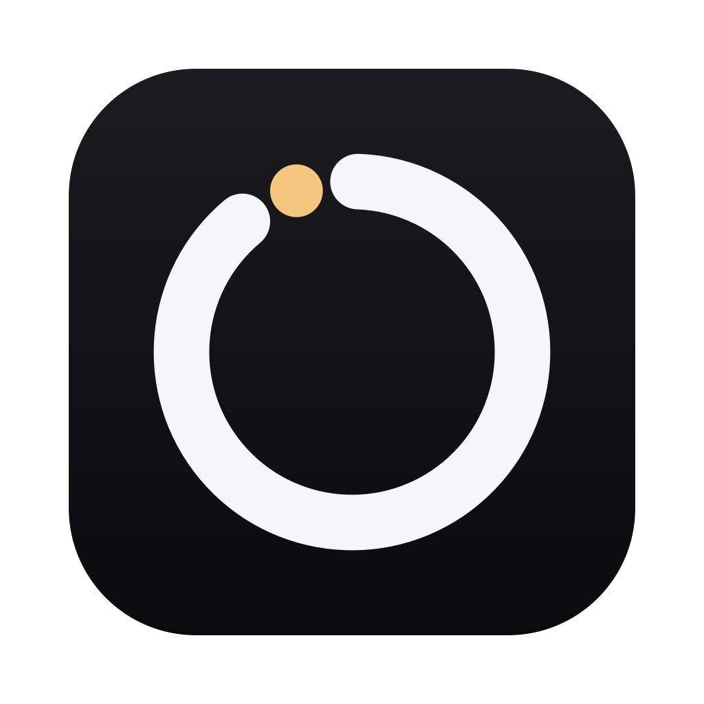
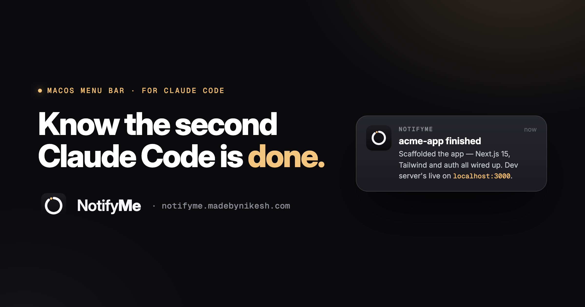

<div align="center">



# NotifyMe

**Know the second Claude Code is done.**

A tiny macOS menu-bar app that pings you the instant a Claude Code session finishes — or needs you — then teleports you back to the exact terminal that raised it. Your time is as valuable as your tokens.

[Website](https://notifyme.madebynikesh.com) · [Download](https://github.com/nikeplusdash/notifyme/releases/latest) · [Report a bug](mailto:ux@madebynikesh.com?subject=NotifyMe%20bug%20report)



</div>

---

## The gap it closes

You kick off a long task and tab away. Claude finishes in forty seconds — you find out twenty minutes later. NotifyMe closes that gap. The moment a session goes from **working** to **done**, a native macOS notification tells you *what Claude said* — not just that something happened — and one click puts you back in the exact tab.

## Features

- **Notified the instant it's done.** A `busy → idle` transition fires a "finished" notification carrying the last thing Claude actually said, so you don't open the terminal just to find out what happened.
- **The notification is a door.** Click it and NotifyMe raises the exact window and focuses the exact terminal tab — VS Code, Terminal.app, or iTerm2 — even across a dozen open windows.
- **Knows when it needs you.** Permission prompts and questions surface as "needs you," the one interruption worth having.
- **Sees the invisible agents.** Background agents that finished their turn and exited — sitting on your reply for hours with no live process to find — still show up. Click through and NotifyMe opens them for you.
- **Quiet when you're already there.** If you're staring at the terminal it just finished in, it says nothing.
- **One switch.** No dashboard, no window, no Dock icon — a menu-bar mark, launch-at-login, and a single Notifications toggle. It reads Claude Code's own local session files and talks to your editor over loopback only; nothing leaves your Mac.

## Install

1. Download the latest build from [**Releases**](https://github.com/nikeplusdash/notifyme/releases/latest) and unzip it.
2. Drag **NotifyMe.app** into `/Applications`.
3. Because builds are ad-hoc signed (not notarized), macOS Gatekeeper will hesitate on first launch: **right-click the app → Open**, then confirm. You only do this once.
4. Grant notification permission when prompted, and optionally flip on **Launch at Login** from the menu.

**Requirements:** macOS 13 Ventura or later, Apple silicon, and [Claude Code](https://docs.claude.com/en/docs/claude-code). Teleport works best with VS Code, Terminal.app, or iTerm2.

> For terminal-tab focusing inside VS Code, install the companion bridge extension in [`vscode-ext/`](vscode-ext/) — see its [README](vscode-ext/README.md).

## Build from source

No Xcode required — the `make` path builds a real, signed `.app` with Command Line Tools alone.

```bash
git clone https://github.com/nikeplusdash/notifyme.git
cd notifyme
make run      # builds build/NotifyMe.app, (re)launches it — look at the menu bar
```

Other targets:

```bash
make build    # assemble and ad-hoc sign build/NotifyMe.app
make stop     # quit any running copy
make xcode    # regenerate NotifyMe.xcodeproj from project.yml (needs xcodegen)
make clean
```

[XcodeGen](https://github.com/yonaskolb/XcodeGen) is the source of truth for the Xcode project: `project.yml` is committed, the generated `NotifyMe.xcodeproj` is not. Run `make xcode` after adding or moving files, and open the project once Xcode is installed.

## How it works

NotifyMe fuses **three views** of your sessions, because each is blind to something the others catch (`Sources/NotifyMe/Registry/FusedSource.swift`):

| Source | Sees | Blind to |
| --- | --- | --- |
| **Registry** (`~/.claude/sessions/`) | every session with a live process, instantly | a status field that silently freezes when Claude Code's remote-control bridge drops |
| **Hooks** (`~/.notifyme/`) | what a session is *actually doing*, event-driven | any session without a live process |
| **`claude agents --json`** | dormant background agents with *no process at all* | terminal sessions |

A transition — never a bare re-read — drives the notifier. Clicking a notification hands off to the **teleporter**, which reaches the owning terminal in three tiers: a loopback `POST /focus` to the VS Code bridge extension; AppleScript tty-matching for Terminal.app and iTerm2; and app-level activation for everything else (Ghostty, Warp, kitty).

Session hooks are **opt-in** and merge into your `~/.claude/settings.json` without clobbering anything you already have there.

## Project layout

```
Sources/NotifyMe/       the app
  UI/                   menu-bar item + icon
  Notify/               transitions → notifications → teleport
  Teleport/             raise the right window / terminal tab
  Registry/             session sources (registry, hooks, agents) + fusion
  Model/                Session, Preferences, SessionSource
vscode-ext/             VS Code bridge extension (focuses a specific terminal tab)
Tools/                  icon generator + debugging harnesses
web/                    the marketing site (deployed to Vercel)
project.yml             XcodeGen spec · Makefile — CLT-only build path
```

## The website

The landing page lives in [`web/`](web/) — a single self-contained `index.html`, deployed to Vercel at [notifyme.madebynikesh.com](https://notifyme.madebynikesh.com).

## Report a bug

NotifyMe is early and feedback is welcome. Email **[ux@madebynikesh.com](mailto:ux@madebynikesh.com?subject=NotifyMe%20bug%20report)** or [open a GitHub issue](https://github.com/nikeplusdash/notifyme/issues/new).

## License

[MIT](LICENSE) © 2026 Nikesh Kumar.

---

<sub>NotifyMe is an independent tool and is not affiliated with, or endorsed by, Anthropic. Claude and Claude Code are trademarks of Anthropic.</sub>
